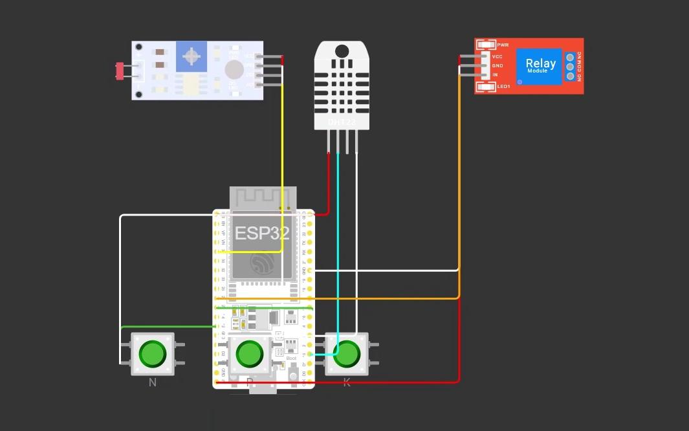
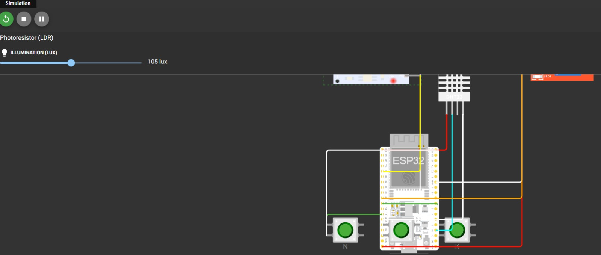

# FIAP - Faculdade de Informática e Administração Paulista

<p align="center">
<a href= "https://www.fiap.com.br/"></a>
</p>

<br>

# Mapa do tesouro

## Nome do grupo

## 👨‍🎓 Integrantes: 
- <a href="https://www.linkedin.com/company/inova-fusca">Arthur Prudêncio Soares — RM569295</a>
- <a href="https://www.linkedin.com/company/inova-fusca">Caroline Coelho Mendes — RM570370</a>
- <a href="https://www.linkedin.com/company/inova-fusca">Leandro Paiva — RM572159</a> 
- <a href="https://www.linkedin.com/company/inova-fusca">Lucas Viana de Lima — RM571835</a> 
- <a href="https://www.linkedin.com/company/inova-fusca">Matheus Tavares Lima — RM572808</a>

## 👩‍🏫 Professores:
### Tutor(a) 
- <a href="https://www.linkedin.com/company/inova-fusca">Nome do Tutor</a>
### Coordenador(a)
- <a href="https://www.linkedin.com/company/inova-fusca">Nome do Coordenador</a>


## 📜 Descrição

🌱 FarmTech Solutions - Fase 2: Sistema de Irrigação Inteligente

Este projeto compõe a Fase 2 do sistema de gestão agrícola da FarmTech Solutions, desenvolvido para a FIAP. O objetivo principal é evoluir o monitoramento climático da fase anterior para um sistema de irrigação automatizado e inteligente, utilizando um microcontrolador ESP32 (simulado via Wokwi).

O sistema toma decisões de irrigação em tempo real com base nos níveis de nutrientes (NPK), pH, umidade do solo e previsões meteorológicas via API.

### 1. Simulador Wokwi (C/C++)

1. Acesse o [Wokwi](https://wokwi.com/).
2. Crie um novo projeto ESP32.
3. Substitua o conteúdo da aba `diagram.json` pelo código de configuração de hardware do projeto.
4. Substitua o conteúdo do `sketch.ino` pelo código C/C++ fornecido.
5. Inicie a simulação (Play).

### 2. Script Python (API de Clima)
1. Certifique-se de ter o Python instalado na sua máquina.
2. Instale a biblioteca `requests` caso não tenha:
   ```bash
   pip install requests

### 3. Execute o script Python fornecido (clima_farmtech.py).

### 4. O terminal Python exibirá as condições de São Paulo e instruirá qual comando enviar ao Wokwi.

Exemplo: COMANDO PARA O WOKWI: Digite 'S' e aperte Enter (Sem previsão de chuva)

### 5. Volte à aba do Wokwi, clique na área do Monitor Serial, digite a letra correspondente (S ou C) e pressione Enter.

## Imagens do circuito





## 🗃 Histórico de lançamentos

* 0.5.0 - XX/XX/2024
    * 
* 0.4.0 - XX/XX/2024
    * 
* 0.3.0 - XX/XX/2024
    * 
* 0.2.0 - XX/XX/2024
    * 
* 0.1.0 - XX/XX/2024
    *
## Link de acesso ao vídeo que apresenta o funcionamento integral do sistema-  https://www.youtube.com/watch?v=dR6tntQKdCA
## 📋 Licença

<p xmlns:cc="http://creativecommons.org/ns#" xmlns:dct="http://purl.org/dc/terms/"><a property="dct:title" rel="cc:attributionURL" href="https://github.com/agodoi/template">MODELO GIT FIAP</a> por <a rel="cc:attributionURL dct:creator" property="cc:attributionName" href="https://fiap.com.br">Fiap</a> está licenciado sobre <a href="http://creativecommons.org/licenses/by/4.0/?ref=chooser-v1" target="_blank" rel="license noopener noreferrer" style="display:inline-block;">Attribution 4.0 International</a>.</p>


